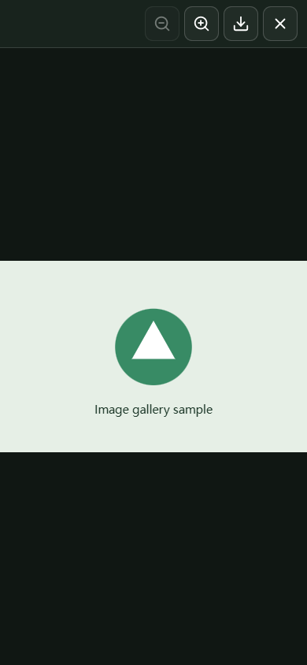

# Media viewer

Reusable image lightboxes, mixed galleries and adaptive video players built with Plyr and hls.js. The component runs entirely in the browser.

- Modern controls: full-width progress on its own row, adjacent current / total time, aligned seek and buffer tracks, large click targets and working settings/fullscreen. Controls adapt to the player container; actual metadata replaces the supplied duration on playback.
- Video loads on play, starts with a small playable rendition and adapts to bandwidth, playback speed and player size. Bounded forward buffering grows with speed; pause and disposal stop new requests.
- Click an optimized image to open a closable full-screen lightbox. Only then request its original.
- Zoom, wheel/pinch, pan and reset; original saving lives in the lightbox toolbar, outside the picture.
- Opens content images, subject to your application's consent and CSP.
- Local icons, no CDN, no telemetry or persisted preferences; keyboard, touch and English / both Chinese locales.

[中文说明](docs/zh-cn.md) | [Used by ishare](https://ishare.js.gripe)




These screenshots show the local component demo. The player uses a purple page accent; its controls also follow live light/dark theme changes.

## Build and try

```sh
npm ci
npm run build
npx serve .
```

Open `/demo/`. Serve the generated `dist/` files from your own origin. The demo uses only a local test fixture.

The package is distributed as GitHub source and has not been published to npm:

```sh
npm install https://codeload.github.com/jsw-teams/media-viewer/tar.gz/main
```

Use these source exports with a bundler:

```js
import { mountVideo } from '@jsw-teams/media-viewer/video';
import { mountImage } from '@jsw-teams/media-viewer/lightbox';
import '@jsw-teams/media-viewer/styles';

const disposeVideo = mountVideo(document.querySelector('video'), {
  source: () => '/media/opaque-id/master.m3u8',
  type: 'hls', // 'native' for a browser-supported MP4/WebM
});
const disposeImage = mountImage(document.querySelector('img'), {
  original: () => '/media/opaque-id/original',
});
```

Call the disposers before removing the elements. Videos use `playsinline`, `preload="none"` and a server-provided poster. Supply `data-duration` in seconds to show the known total before playback; actual metadata replaces it on play. `source` accepts a function; `original` accepts a URL or function and is evaluated on click. Without `original`, the lightbox uses `data-original`, then the currently displayed image. While loading the original, the dialog shows a loading status rather than an optimized preview.

`watchImage(image, {labels})` adds error/retry feedback without opening a lightbox. `mountGallery(root, {mountVideo, labels, onChange})` consumes the markup in `demo/index.html` and `<template>` slides. Inject a lazy video mount function to avoid loading video JavaScript on image-only pages. `onChange({index,stage})` can update external application controls. Custom `labels` and Plyr `i18n` dictionaries extend or override translations.

The player inherits the page's `--accent`, `--surface` (or `--paper`), `--ink`, `--bg` and `--line` CSS variables, including live light/dark theme changes. For another theme system, map its colors to `--media-accent`, `--media-surface`, `--media-ink` and `--media-accent-ink` on the player or an ancestor. These affect the playback accent, accent foreground and settings menu without recoloring the video itself. HLS uses hls.js when Media Source Extensions are supported, with native HLS as a fallback; explicit `type: 'native'` retains browser playback for MP4/WebM.

Images retain your `srcset` and `sizes`. The component does not resize files, transcode media, authenticate users or implement uploads/storage/signing. Image viewing uses direct browser loading; initialize it only for content your visitor has authorized. CSP must permit the configured image/media hosts, local scripts/styles and playback `blob:`. Icons are bundled once per document, and cancellation uses a local Blob rather than an external blank-video host.

## Test and license

```sh
npx playwright install chromium
npm test
```

Tests use local media and mocked image responses, never production uploads. MIT for the component; [dependency licenses](NOTICE.md) remain applicable.
