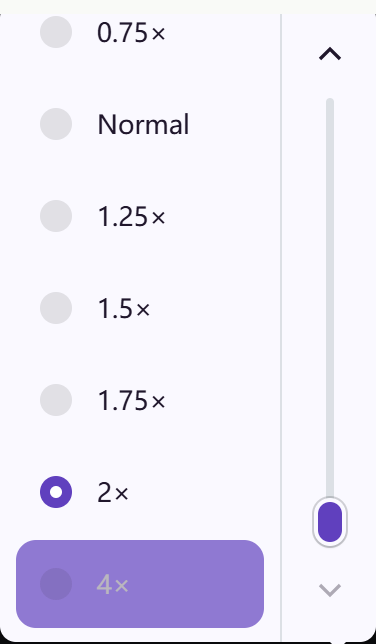

# 图片与视频浏览组件

Media viewer 提供视频播放器、混合附件画廊和可关闭的图片放大查看器，使用 Plyr 与 hls.js。图片平时显示优化版本；点击后才请求原图。轻透查看器只保留独立的关闭叉号，保存使用浏览器的图片菜单，不覆盖图片画面。点击、滚轮或双指缩放，放大后拖动；键盘 +、- 缩放，0 重置，方向键移动。

配图来自本地组件演示。播放器采用页面提供的紫色强调色，随页面明暗主题变化，不固定使用绿色。

倍速选中标记与数字使用独立位置，窄屏菜单提供与页面配色一致的上下按钮和可拖动滚动条，也支持触摸、滚轮和键盘。图片查看器的操作栏与加载状态位于图片外侧，完整适配剩余画面；视口变化后重新计算缩放与拖动范围。

进度条独立一行，当前时间与总时长以「当前 / 总时长」相邻显示，手机播放、静音、设置和全屏在下方操作栏。布局按播放器容器宽度适配；播放后以实际视频元数据更新时长。图片支持滚轮／双指缩放与拖动，叉号与 Escape 关闭后返回原页面。可提供原图地址，或直接放大当前图片；原图加载时显示加载状态，不在弹窗中展示优化图。

## 接入

运行 `npm ci`、`npm run build`，用静态服务器打开 `/demo/`。构建生成 `dist/` 的 ES 模块与 CSS，可放在自己的站点并使用内容哈希缓存。打包工具可按主 README 从 GitHub 源码安装；目前没有发布 npm 包。

- `mountVideo(video, {source, type})`：`source` 是返回视频地址的函数；HLS 用 `type: 'hls'`，浏览器支持的 MP4/WebM 用 `type: 'native'`。`poster` 使用应用提供的封面；`data-duration` 提供秒数，在播放前显示总时长，播放后以实际视频元数据为准。
- `mountImage(image, {original, labels})`：`original` 是 URL 或返回 URL 的函数，只在打开查看器时求值。未提供时使用 `data-original` 或当前图片。
- `watchImage(image, {labels})`：仅增加失败占位和手动重试，用于仍需要导航到详情页的图片卡片。
- `mountGallery(root, {mountVideo, labels, onChange})`：结构参考演示，以 `<template>` 保存未选附件，注入动态导入的视频组件。`onChange({index,stage})` 可更新画面外的操作栏。

组件返回清理函数，页面卸载或切换路由时调用。画廊切换时清理当前视频和图片查看器。视频仅点击播放后请求资源，暂停停止后续分片；先用较小的可播放分片起播，再根据网速、倍速和播放器尺寸自动提升清晰度，最多保留 2 倍显示密度。前向缓冲随倍速增长并设上限，不预先下载整段长视频。页面语言默认支持英文、简体、繁体中文，可用 `labels` 和播放器 `i18n` 覆盖或增加其他语言。

播放器跟随页面的 `--accent`、`--surface`（或 `--paper`）、`--ink`、`--bg` 和 `--line` 配色变量，切换明暗主题会同步生效。其他主题系统可在播放器或上层元素设置 `--media-accent`、`--media-surface`、`--media-ink`、`--media-accent-ink`，对应播放强调色、设置菜单背景、文字及强调色按钮前景。HLS 在支持 MSE 时使用 hls.js 自适应加载；不支持时使用原生 HLS。明确设置 `type: 'native'` 的 MP4/WebM 仍由浏览器直接播放。

图片优化、上传、鉴权、签名代理、封面生成和存储由接入应用负责。组件无平台账户、密钥或后端绑定。图片由浏览器加载；已有 consent 服务仍需访客授权后才能接入，CSP 也需允许对应图片源。图标随 JS 本地打包；MSE 播放与取消用本地 `blob:`。

## 验证与许可

先运行 `npx playwright install chromium`，再运行 `npm test`。测试使用本地视频和模拟图片，检查窄屏、播放、设置、键盘、全屏、切换、按需原图、关闭与失败重试，不会上传生产记录。

组件采用 MIT，Plyr 与 hls.js 保留原许可，见 [NOTICE.md](../NOTICE.md)。
